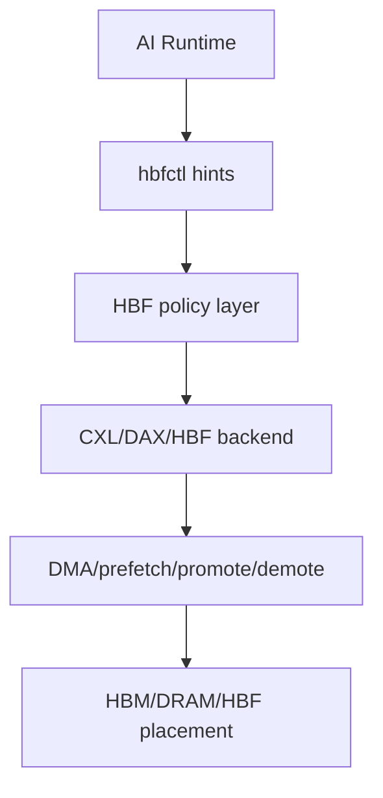

# linux-hbf-control-plane

> HBF only becomes useful when the system can move data before compute asks for it.

`linux-hbf-control-plane` is an experimental Linux kernel RFC project for a future High Bandwidth Flash (HBF) control plane aimed at AI inference runtimes.

HBF sits between fast on-package memory and cold storage:

- HBM = hot working set
- HBF = high-capacity warm context tier
- SSD/object store = cold tier

AI runtimes understand tokens, KV blocks, and reuse distance. The kernel understands pages, devices, NUMA topology, and memory tiering. This project explores the thin control-plane boundary between those two views.

## Status

This repository is:

- Experimental
- RFC-oriented
- Not upstream
- Not bound to any public HBF hardware programming model

The intent is to discuss a plausible Linux abstraction for future CXL-attached or otherwise heterogeneous high-capacity memory devices used by AI inference systems. It does **not** claim that an upstream Linux HBF subsystem exists today.

## Why Linux Matters

Inference runtimes often know which context ranges are about to become important before the processor or accelerator touches them. Linux already owns the machinery that ultimately decides where bytes live and how they move:

- CXL Type-3 memory exposure
- DAX mappings and `dax_kmem`
- memory hotplug
- memory tiering and NUMA balancing
- DMA-assisted migration and page placement

That makes Linux the natural place for a control-plane API that can translate runtime intent into placement and staging decisions, instead of pretending the problem is just block storage.

## What This Is

- An experimental Linux kernel control-plane proposal
- A runtime-to-kernel hint API sketch
- An AI memory hierarchy research artifact
- An LKML discussion starter

## What This Is Not

- Not an upstream driver
- Not a shipping HBF hardware driver
- Not a replacement for CXL or DAX
- Not a benchmark claim

## Repository Layout

- [README.md](README.md)
- [docs/architecture.md](docs/architecture.md)
- [docs/design-rationale.md](docs/design-rationale.md)
- [docs/lkml-cover-letter.md](docs/lkml-cover-letter.md)
- [docs/testing.md](docs/testing.md)
- [docs/roadmap.md](docs/roadmap.md)
- [docs/references.md](docs/references.md)
- [docs/repo-positioning.md](docs/repo-positioning.md)
- [examples/hbfctl-demo.c](examples/hbfctl-demo.c)
- [scripts/check-patch.sh](scripts/check-patch.sh)
- `rfc-hbf-linux-control-plane.patch`

## Project Positioning

Suggested GitHub description:

> Experimental Linux RFC for an HBF/CXL-era AI memory control plane: runtime hints, prefetch, placement, and tiering.

Suggested GitHub topics:

- `linux-kernel`
- `cxl`
- `dax`
- `memory-tiering`
- `hbf`
- `high-bandwidth-flash`
- `ai-inference`
- `kv-cache`
- `dma`
- `systems-research`

## Getting Started

1. Place or generate `rfc-hbf-linux-control-plane.patch` at the repository root.
2. Review the design documents under `docs/`.
3. Run `./scripts/check-patch.sh`.
4. Build the userspace mock example in `examples/`.

## Framing

This repository assumes that any future HBF solution will likely live near the CXL and memory-tiering ecosystem, where byte-addressable memory capacity can already be surfaced as DAX or onlined into the page allocator. The proposal here is a thin control plane for expressing prefetch, promote, demote, and placement hints early enough to matter for AI inference.
