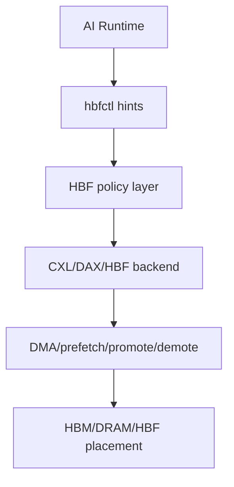

# linux-hbf-control-plane

> HBF only becomes useful when the system can move data before compute asks for it.

`Experimental` `RFC` `No Upstream HBF Hardware Binding` `Not Production`

`linux-hbf-control-plane` is a documentation-first RFC project around a possible Linux control plane for future HBF-like high-capacity memory tiers used by AI inference runtimes.

This repository does **not** claim that:

- Linux has an upstream HBF subsystem today
- public HBF hardware programming specifications exist today
- the current prototype patch is ready for upstream review without major revision

Instead, it explores whether runtime-guided prefetch, promote, demote, and placement hints could fit near existing Linux building blocks such as CXL, DAX, memory hotplug, memory tiering, NUMA policy, and migration.

## Problem Statement

Inference runtimes increasingly manage memory hierarchies that look like this:

- HBM = hot working set
- HBF = high-capacity warm context tier
- SSD/object store = cold tier

The hard part is not naming a new tier. The hard part is moving data early enough that compute does not stall waiting for it.

AI runtimes often know which tokens, sequences, KV blocks, and context ranges are likely to be touched next. Linux knows about VMAs, pages, folios, devices, DMA, NUMA nodes, migration, and tiering. A useful control plane has to connect those two views without pretending that AI semantics themselves belong directly in the MM fast path.

## Why Linux Is Involved

The runtime can estimate reuse distance and future demand.

The kernel can:

- validate ownership of mappings
- decide whether a range can be migrated or prefetched
- translate hints into placement or staging work
- account memory and isolate tenants
- observe outcomes through tracepoints and existing MM tooling

That makes Linux the natural place to evaluate an advisory hint interface, especially if any future HBF-like hardware is exposed through CXL, DAX, driver-managed memory, or related heterogeneous-memory mechanisms.

## Proposed Architecture

The proposal is a thin runtime-to-kernel control plane, not a replacement for CXL, DAX, or memory tiering.



The control plane is intentionally advisory:

- runtime expresses intent
- kernel validates and admits or rejects the hint
- backend may ignore the hint if unsupported
- correctness must never depend on hint acceptance

## What This Is

- An experimental Linux kernel control-plane proposal
- A review target for an RFC patch under [rfc-hbf-linux-control-plane.patch](rfc-hbf-linux-control-plane.patch)
- A research artifact for AI memory hierarchy discussion
- A staging area for documentation, critique, and patch decomposition before any serious upstream attempt

## What This Is Not

- Not an upstream Linux driver
- Not a shipping HBF hardware driver
- Not proof that HBF belongs in a standalone kernel subsystem
- Not a benchmark result
- Not a substitute for CXL, DAX, memory tiering, or existing MM review

## Repository Layout

- [README.md](README.md): top-level framing and workflow
- [rfc-hbf-linux-control-plane.patch](rfc-hbf-linux-control-plane.patch): prototype RFC patch under review
- [docs/patch-review.md](docs/patch-review.md): critical review of the current prototype patch
- [docs/rfc-v1-plan.md](docs/rfc-v1-plan.md): cleaner series plan for a documentation-first RFC v1
- [docs/lkml-objections.md](docs/lkml-objections.md): likely reviewer objections and how to answer them honestly
- [docs/api-options.md](docs/api-options.md): comparison of ABI surfaces
- [docs/control-plane.md](docs/control-plane.md): detailed control-plane model
- [docs/kernel-integration-map.md](docs/kernel-integration-map.md): potential subsystem landing points
- [docs/benchmark-plan.md](docs/benchmark-plan.md): proxy experiments in lieu of real hardware
- [docs/tracepoints.md](docs/tracepoints.md): observability proposal
- [docs/testing.md](docs/testing.md): local checks and readiness steps
- [docs/references.md](docs/references.md): upstream documentation links
- [docs/github-positioning.md](docs/github-positioning.md): repo description and topics
- [examples/hbfctl-demo.c](examples/hbfctl-demo.c): mock userspace ioctl example
- [scripts/check-patch.sh](scripts/check-patch.sh): local patch and example validation helper
- [scripts/make-rfc-series.sh](scripts/make-rfc-series.sh): instructions for generating patch series from commits

## Build And Check

Local checks:

```bash
./scripts/check-patch.sh
```

Userspace example:

```bash
gcc -Wall -Wextra -O2 -o examples/hbfctl-demo examples/hbfctl-demo.c
```

Kernel patch style, if a kernel tree is available:

```bash
export KERNEL_TREE=/path/to/linux
$KERNEL_TREE/scripts/checkpatch.pl --strict rfc-hbf-linux-control-plane.patch
```

This repository is for local development and RFC preparation only. It does not send email or submit anything.

## How To Regenerate Patches Later

Kernel patches should be generated from commits, not hand-maintained forever.

Use:

```bash
./scripts/make-rfc-series.sh
```

That script only prints local instructions. It does **not** send email and does **not** invoke any mailing-list submission flow.

## LKML Readiness Checklist

Before treating any series here as ready for manual submission:

- review [docs/patch-review.md](docs/patch-review.md)
- review [docs/lkml-objections.md](docs/lkml-objections.md)
- run `scripts/check-patch.sh`
- run `scripts/checkpatch.pl --strict`
- review the Linux kernel patch submission guide:
  [`Documentation/process/submitting-patches.rst`](https://kernel.org/doc/html/next/process/submitting-patches.html)
- review the Linux kernel patch submission checklist:
  [`Documentation/process/submit-checklist.rst`](https://www.kernel.org/doc/html/latest/process/submit-checklist.html)
- verify that the series is honest about missing hardware bindings and missing evidence
- verify that no part of the ABI is being presented as settled

## Roadmap

- v0: prototype patch plus repo documentation
- v1: documentation-first RFC series with minimal UAPI and miscdevice skeleton
- v2: tracepoints and statistics
- v3: backend experiments tied to CXL/DAX or migration paths
- v4: runtime trace replay and proxy benchmarking
- v5: policy, accounting, and cgroup discussion if the basic abstraction survives review

## References

Key background documents are collected in [docs/references.md](docs/references.md), including:

- Linux CXL documentation
- Linux DAX documentation
- Linux memory hotplug documentation
- Linux NUMA and memory-tiering controls
- Linux HMM documentation
- Linux patch submission process documentation
